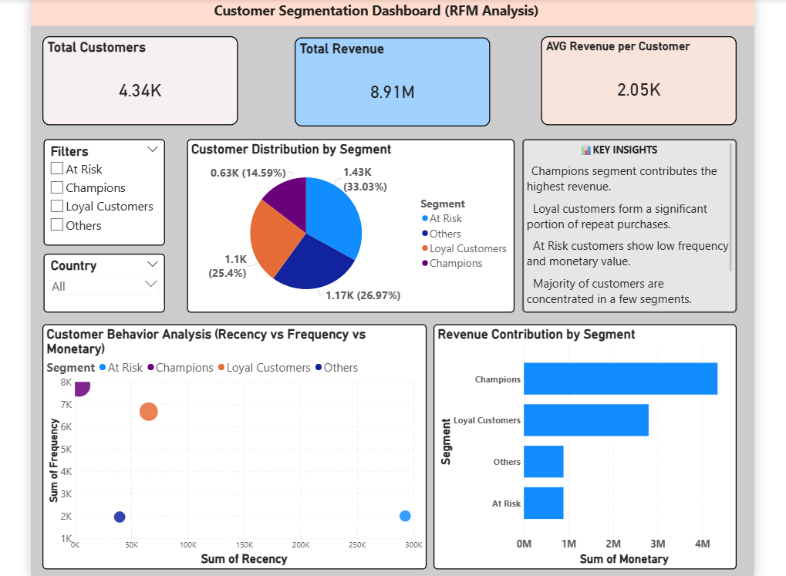

# 🧠 Customer Segmentation using RFM Analysis
## 📋 Overview

The Customer Segmentation using RFM Analysis project focuses on analyzing customer purchasing behavior and dividing customers into meaningful segments based on their activity.

This end-to-end data analytics project uses Python for data processing and Power BI for interactive visualization to help businesses understand customer value, improve retention, and optimize marketing strategies.

---

## 📁 Dataset
- **Source:** [Kaggle - Online Retail II](https://www.kaggle.com/code/pinardogan/rfm-analysis-using-online-retail-ii-dataset/input)
- **Note:** Due to the large file size, a compressed version is provided in this repository.
- **Attributes:** 8 core columns, including:
  - `Invoice`, `StockCode`, `Description`
  - `Quantity`, `InvoiceDate`, `Price`
  - `Customer ID`, `Country`

This dataset enables detailed behavioral and segmentation analysis.

### 🎯 Objective

The main goals of this project are:

- **Analyze customer purchasing behavior**
- **Perform segmentation using RFM (Recency, Frequency, Monetary)**
- **Identify high-value and low-engagement customers**
- **Provide actionable insights using dashboards**
---

## 🛠️ Tools and Technologies  
| Tool | Purpose |
| :--- | :--- |
| **Python (Pandas, NumPy)** | Data cleaning and transformation |
| **Power BI** | Dashboard and visualization |
| **Google Collab** | Python implementation (`customer_analysis.ipynb`) |
| **CSV Dataset** | Data source |

## 🔍 Project Workflow
### 1. **Data Processing (Python)**
- Cleaned and structured raw transactional data
- Grouped data by Customer ID
### - **Calculated key metrics:**
- Recency → Days since last purchase
- Frequency → Number of transactions
- Monetary → Total spending

### 2. **RFM Scoring**

- Each customer was assigned scores:

- R Score (Recency)
- F Score (Frequency)
- M Score (Monetary)

- These scores were used to rank and segment customers.

### 3. **Customer Segmentation**

- Customers were categorized into:

- 🏆 Champions → High value, frequent buyers
- 🔁 Loyal Customers → Consistent repeat buyers
- ⚠️ At Risk → Previously active but now inactive
- 👤 Others → Low engagement or new customers
---

## 📊 Power BI Dashboard

The interactive dashboard provides a complete business view.

### Key Visuals:
- ### KPI Cards:
 - **Total Customers: 4.34K**
 - **Total Revenue: 8911.41K**
 - **Avg Revenue per Customer: 2.05K**
- ### Customer Distribution (Pie Chart)
 - **Shows segmentation distribution (as seen in page 3 image)**
- ### Revenue Contribution (Bar Chart)
- **Highlights which segment generates the most revenue (page 3)**
- ### Customer Behavior Analysis (Scatter Plot)
 - **Relationship between:**
 - **Recency**
 - **Frequency**
- **Monetary (page 4)**
- ### Filters (Slicers)
 - **Segment filter**
- **Country filter**

---

## ✅ Results & Insights
- **Champions** generate the highest revenue.
- Loyal customers ensure stable recurring income
- At Risk customers indicate potential churn
- High recency (inactive users) correlates with low engagement
- Majority of revenue comes from a few key segments

---

## 💼 Business Implications
Focus on retaining Champions & Loyal Customers
Create re-engagement campaigns for At Risk customers
Personalize marketing based on customer segments
Improve long-term customer retention strategies

## 🏁 Conclusion 

This project demonstrates how RFM analysis can effectively segment customers and drive business decisions.

It showcases:

- Data preprocessing using Python
- Customer segmentation techniques
- Business intelligence using Power BI
